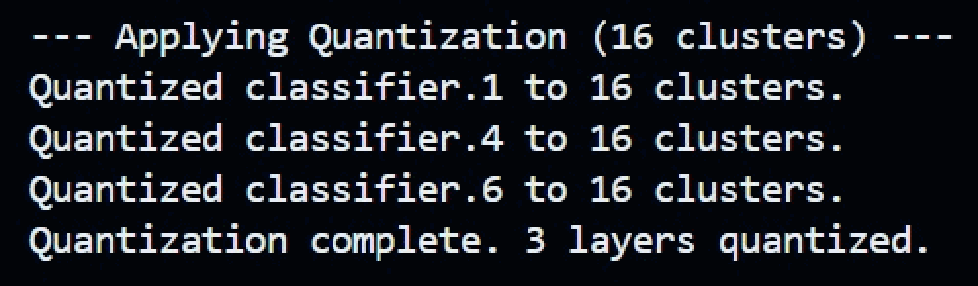
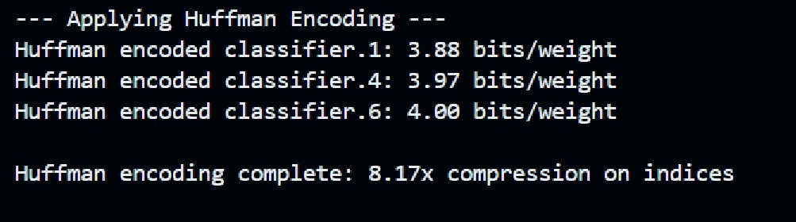
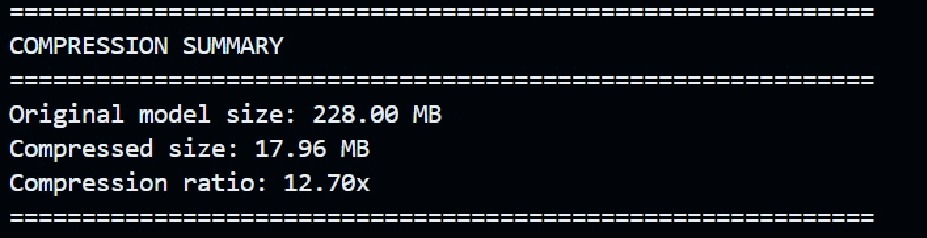

# Deep Neural Network Compression & CV

Compressing a CIFAR-10 image classifier with a three-stage pipeline — **magnitude pruning → k-means quantization → Huffman encoding** — and serializing it into a compact `.npz` file. The goal is to shrink the model's storage and runtime memory footprint while preserving as much classification accuracy as possible.

The classifier is a multilayer perceptron (MLP) trained on top of a **frozen, pre-trained AlexNet** feature extractor, so training is fast and the compression methods can be studied in isolation on the trainable layers.

---

## Table of Contents

- [Overview](#overview)
- [How It Works](#how-it-works)
- [Model Architecture & Dataset](#model-architecture--dataset)
- [The Compression Pipeline](#the-compression-pipeline)
- [Results](#results)
- [Project Structure](#project-structure)
- [Installation](#installation)
- [How to Run](#how-to-run)

---

## Overview

Modern neural networks are heavily over-parameterized, which makes them expensive to store and to load into memory. This project demonstrates that a large fraction of those parameters are redundant: by combining three classic compression techniques we reduce model size by **~12.7×** with only a small accuracy drop.

The pipeline is fully end-to-end and reproducible from a single entry point (`main.py`):

1. **Baseline training** of an MLP on frozen AlexNet features.
2. **Magnitude pruning** to ~90% sparsity, with short fine-tuning to recover accuracy.
3. **K-means quantization** of the surviving weights into 16 cluster centers.
4. **Huffman encoding** of the quantized indices to exploit their non-uniform frequencies.
5. **Compact `.npz` serialization** storing only masks, cluster centers, indices, and biases.

---

## How It Works

```
Image (CIFAR-10)
   │  resize / crop / normalize
   ▼
Frozen AlexNet .features  ──►  9216-dim feature vector   (no gradients, weights fixed)
   ▼
CompressionMLP  9216 → 4096 → 1024 → 10   (ModifiedLinear layers, trainable)
   │
   ├─ 1. Train (baseline)
   ├─ 2. Prune 90%  + fine-tune
   ├─ 3. Quantize (k=16, k-means)
   ├─ 4. Huffman-encode indices
   └─ 5. Save → compressed_mlp.npz
```

Only the MLP is trained; AlexNet acts purely as a fixed feature extractor. This separation means the compression operates entirely on the `ModifiedLinear` layers, which are custom `nn.Linear` subclasses that carry a pruning mask, quantization cluster centers, and quantized indices, and can run in `normal`, `pruned`, or `quantized` mode.

---

## Model Architecture & Dataset

### Dataset — CIFAR-10
10 object categories. Because AlexNet expects larger inputs than CIFAR-10's native 32×32, images are resized before feature extraction.

**Training augmentation:** resize to 256, random crop to 224×224, random horizontal flip, convert to tensor, normalize with CIFAR-10 mean/std.
**Testing:** resize to 224×224, normalize, no augmentation.

### Feature extraction — frozen AlexNet
The `features` block of a pre-trained AlexNet is used with all parameters frozen (`requires_grad = False`, `eval()` mode). Each image produces a feature map that is flattened to a **9216-dimensional** vector (256 × 6 × 6), which is the input to the trainable classifier.

### Classifier — `CompressionMLP`
A custom MLP built from `ModifiedLinear` layers:

```
9216 → 4096 → 1024 → 10
```

with ReLU activations and dropout (p = 0.5) between blocks. The `ModifiedLinear` layer is the key component — it stores a pruning mask, quantization cluster centers, quantized cluster indices, and optional Huffman bitstreams/codebooks, so the same network can operate in normal, pruned, or quantized mode.

---

## The Compression Pipeline

### 1. Baseline Training
The MLP is trained on frozen AlexNet features using cross-entropy loss and the Adam optimizer (learning rate 1e-4) for 5 epochs. Gradients flow only through the MLP. This establishes the reference accuracy.

### 2. Magnitude Pruning
Global **L1 magnitude pruning**: all absolute weight values across the `ModifiedLinear` layers are collected, a global threshold is computed for the target prune ratio (**90%**), and weights below it are masked to zero. The weights are not physically removed — a binary mask ensures they do not contribute during the forward pass. The model is then fine-tuned for 2 epochs so the surviving weights can partially recover the lost accuracy.

### 3. K-Means Quantization
The remaining non-zero weights are clustered with **k-means using k = 16 clusters**. Each surviving weight is replaced by its nearest cluster center, so instead of storing full 32-bit floats the model stores small cluster **indices** plus the 16 cluster centers. With k = 16, each index needs only 4 bits before entropy coding.



### 4. Huffman Encoding
The quantized indices have a non-uniform frequency distribution. Huffman coding assigns shorter codes to frequent indices and longer codes to rare ones, reducing the **average bits per weight** below the fixed 4-bit cost — an additional compression gain on top of pruning and quantization.



### 5. Model Serialization
The compressed model is saved as a compact `.npz` (`np.savez_compressed`) storing only the essential representation: biases, boolean sparse masks, cluster centers, and quantized indices in compact integer form (`uint8` for k ≤ 256). Boolean masks and small integer indices take far less space than dense float tensors, so the file is dramatically smaller than a standard dense checkpoint.



---

## Results

### Storage & Compression Ratio

| Metric | Value |
|---|---|
| Original model size | 228.00 MB |
| Compressed model size | 17.96 MB |
| **Compression ratio** | **12.70×** |

The compressed model occupies less than one-sixteenth of the original storage, while the three-stage pipeline removes redundant capacity without meaningfully changing the model's predictions.

---

## Project Structure

```
compressed_models-main/
├── main.py                     # End-to-end pipeline entry point
├── config.py                   # Device selection + data constants
├── requirements.txt
├── compression/
│   ├── __init__.py
│   ├── linear.py               # ModifiedLinear (prune / quantize / modes)
│   ├── conv2d.py               # ModifiedConv2d (conv-layer counterpart)
│   ├── pruning.py              # Global L1 magnitude pruning
│   ├── quantization.py         # K-means weight quantization
│   └── huffman.py              # Huffman coding + compression summary
├── data/
│   ├── __init__.py
│   └── data_loader.py          # CIFAR-10 loaders + AlexNet preprocessing
├── models/
│   ├── __init__.py
│   └── model_cifar.py          # CompressionMLP
├── utils/
│   ├── __init__.py
│   ├── training.py             # train_and_eval (frozen AlexNet features)
│   ├── test_eval.py            # evaluate
│   └── loading.py              # save / load compressed .npz
└── docs/images/                # Figures used in this README
```

---

## Installation

```bash
git clone <your-repo-url>
cd compressed_models-main

python -m venv venv
source venv/bin/activate          # Windows: venv\Scripts\activate

pip install -r requirements.txt
```

Requires Python 3.9+. The first run automatically downloads CIFAR-10 (into `./data_files`) and the pre-trained AlexNet weights.

---

## How to Run

Run the full pipeline (train → prune → quantize → Huffman → serialize):

```bash
python main.py
```

This prints per-stage logs (training loss, sparsity, quantization, Huffman bits/weight, and the final compression summary) and writes the compressed model to `compressed_models/compressed_mlp.npz`.

To load a saved compressed model back into a PyTorch model:

```python
import torch
from models.model_cifar import CompressionMLP
from utils.loading import load_model_from_npz

device = torch.device("cpu")
model = CompressionMLP().to(device)
model = load_model_from_npz(model, "compressed_models/compressed_mlp.npz", device)
```

You can adjust the prune ratio, number of clusters, and epoch counts directly in `main.py`, and the batch size / data path in `config.py`.
